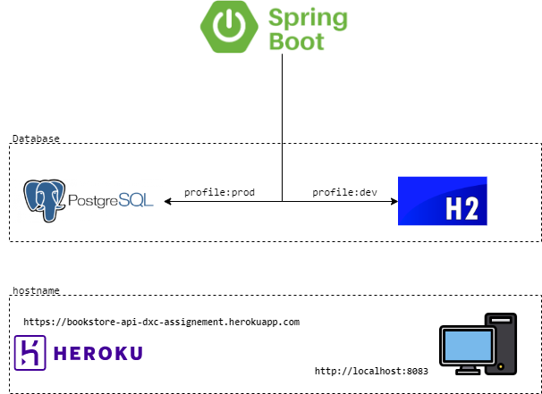
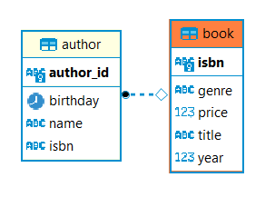

# Assignment for technical assessment [(Requirement)](./src/main/resources/Bookstore%20API%20(Design).docx)

### Introduction
The Bookstore project is an API service that categorize all the books in this store. It provides a top-of-the-line method to access the book information.

### Features
The Bookstore API provides the following features:

- Add a new book
- Update book
- Find books by title and/or author (Exact Match)
- Delete book (Restricted permission)

### Technology Stack
The Bookstore API is built using the following technology stack:

- Java 11
- Spring Boot Framework
- Maven
- H2 Database (for local development environment)
- PostgreSQL (for production environment)

The Spring Boot Framework provides a robust and scalable platform for building web applications. H2 Database is used for local development, providing an in-memory database for quick and easy testing. For production, the project is configured to use PostgreSQL, a powerful and reliable relational database management system.

By utilizing these technologies, the project is able to deliver a fast, reliable, and secure web application for managing assignments and students.

### Architecture diagram illustration

### DB diagram illustration

### Hostname

- dev profile: `http://localhost:8083`  
- prod profile: `https://bookstore-api-dxc-assignement.herokuapp.com`  

### Preloaded data

We have also pre-loaded data for user to begin search / update / delete query

Click to expand
 

    [
      {
        "isbn": "11e89a80-5454-4244-8379-0209cfd5d1a8",
        "title": "Ghostbusters",
        "author": [
          {
            "name": "John",
            "birthday": "30-08-1985"
          },
          {
            "name": "Bob",
            "birthday": "30-08-1970"
          }
        ],
        "year": 2000,
        "price": 25.5,
        "genre": "Horror"
      },
      {
        "isbn": "b93861d7-c4d4-4d45-ad4f-38341793a5a2",
        "title": "Stock trading",
        "author": [
          {
            "name": "Peter",
            "birthday": "30-08-1995"
          },
          {
            "name": "Adam",
            "birthday": "30-08-1971"
          }
        ],
        "year": 2000,
        "price": 75.2,
        "genre": "Finance"
      }
    ]

  

### How to Run

To run the Bookstore API, follow these steps:

- Make sure you have fulfilled the above software requirements.

- Clone this repository to your local machine by running the below command in terminal:

      git clone https://github.com/norulshahlam/bookstore-api-dxc-assignement.git

- Navigate to the project directory in the terminal/command prompt.

- Build the app by running the following command:

       mvn clean install package

- The build application will be stored in /target folder. Now run the following command to run the app:  

       java -jar target/bookstore-api-0.0.1-SNAPSHOT.jar

- Now your application has started. By default, dev profile is selected and there is a preloaded data as mentioned above.

- You can test the API using swagger by opening any browser and use the following url:

      {hostname}/swagger-ui/index.html#/

- Alternatively, you can use postman to manually test the endpoints. Download the postman  collection [**HERE**](./src/main/resources/dxc-assignment-bookstore-api.postman_collection.json), and use Postman to import this collection. Now you can test the endpoints using Postman. Make sure you have postman installed. You can click [**HERE**](https://www.postman.com/downloads/) to download if you dont't have one.

- As this is secured API, you have to enter your credentials. A prompt will be shown when you go to the swagger endpoint. If you are using Postman, add this credentials under basic auth:
   
       ROLES_USER
       username: user
       password: password
                
       ROLES_ADMIN
       username: admin
       password: password

- Operations with assigned roles:

       Add a new book - ROLES_USER
       Update book - ROLES_USER
       Find books by title and/or author (Exact Match) - ROLES_USER
       Delete book (Restricted permission) - ROLES_ADMIN

- You may skip all steps above if the production hostname is available, to access Swagger (don't forget credentials!).
   
       https://bookstore-api-dxc-assignement.herokuapp.com/swagger-ui/index.html

8. For any issues, email me at norulshahlam@gmail.com or whatsapp me at +6592212152

### Conclusion

Congratulations, you have successfully compiled and run the application!